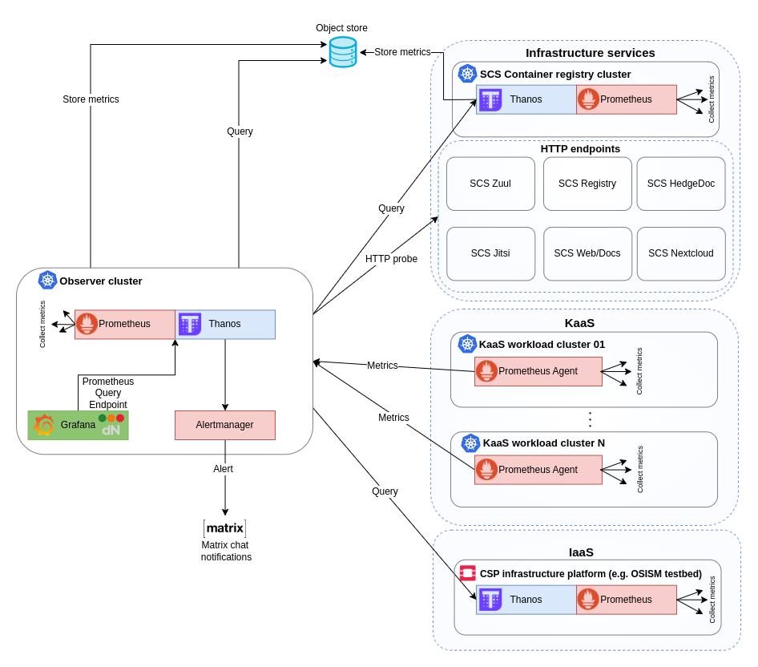

# :mag: k8s-observability 

This repository aims to build an Observer monitoring solution intended to offer a global **metrics**
view of the CSP infrastructure. It is the platform where CSP infrastructure **metrics**
are fetched, processed, stored, and visualized. Note that this monitoring solution could
be extended, and the other two observability signals (logs and traces) from the CSP
infrastructure could also be processed here.

_This repository builds a base for an Observer monitoring solution intended to become an **SCS product**
in the future versions, once it attains sufficient stability. Currently, it is not
intended for deployment in production environments._

The current state implements the initial iteration of the Observer monitoring solution,
deployed in the Kubernetes cluster, subsequently referred to as the Observer cluster.
As illustrative examples of how this monitoring solution can be utilized, the initial version also
implements three use cases:
- Monitoring of the KaaS layer
- Monitoring of the IaaS layer
- Monitoring of infrastructure services (such as CSP services deployed on top of the IaaS layer)

_The monitoring stack employed for observing the KaaS layer and infrastructure services
is designed to serve as an **SCS product** in the future versions, once it attains sufficient stability._



# Deployment

These deployment steps cover the process of deploying the Observer monitoring solution
into the Kubernetes cluster. Additionally, they provide optional guidance for deploying
a KaaS mock service, showcasing the Monitoring of the KaaS layer use case. Furthermore,
there is an optional guide for deploying the blackbox exporter, enabling the monitoring
of infrastructure endpoint availability.
The monitoring of the IaaS layer use case is beyond the scope of these deployment steps.


## Prerequisites

- [kind](https://kind.sigs.k8s.io/)
- [kubectl](https://kubernetes.io/docs/reference/kubectl/)
- [helm](https://helm.sh/)
- [jsonnet](https://github.com/google/go-jsonnet)
- [python 3.8+](https://www.python.org/) - needed for Monitoring of the KaaS layer use case
- [make](https://www.gnu.org/software/make/)
- [git](https://git-scm.com/)

## Observer monitoring deployment

### Create Kubernetes cluster

```bash
kind create cluster --config kind-observer-config.yaml --image kindest/node:v1.27.3 --name observer
```

If you opt not to use KinD and prefer utilizing an existing Kubernetes cluster,
ensure that the metric endpoints for various control plane components are properly exposed.
Refer to the [docs](https://dnationcloud.github.io/kubernetes-monitoring/helpers/FAQ/#kubernetes-monitoring-shows-or-0-state-for-some-control-plane-components-are-control-plane-components-working-correctly).

### Deploy dnation-kubernetes-monitoring-stack

Deploy dnation-kubernetes-monitoring-stack with SCS variables:

_Optional_: Configure the object store as a long-term storage for metrics. Fill the
`thanos-objstore.yaml` template manifest with the bucket credentials (refer to `thanosStorage.config`).

_Optional_: Apply SCS brand secrets and optionally also letsencrypt issuer.
  Uncomment also all SCS brand related parts in `values-observer.yaml`.
  ```bash
  kubectl apply -f scs/logo.yaml
  kubectl apply -f scs/brand.yaml
  kubectl apply -f scs/issuer.yaml  # Optional
  ```

```bash
helm repo add dnationcloud https://dnationcloud.github.io/helm-hub/
helm repo update dnationcloud
helm upgrade --install dnation-kubernetes-monitoring-stack dnationcloud/dnation-kubernetes-monitoring-stack \
  -f values-observer.yaml \
  -f thanos-objstore.yaml  # Optional
```

### Optional: Monitoring of the KaaS layer deployment

Note: This section is part of MVP0 version

To test the Monitoring of the KaaS layer use case, deploy the Kaas-metric-importer
into the Observer cluster.

The Kaas-metric-importer is a simple service through which the KaaS software registers
and unregisters newly created or deleted KaaS clusters in the Observer monitoring.
This functionality enables the Observer monitoring to differentiate between KaaS clusters deleted intentionally
and those that have stopped writing metrics to the Observer monitoring for any reason.

```bash
kubectl apply -f kaas-metric-importer.yaml
```

The Kaas-metric-importer uses an image built from https://github.com/m3dbx/prometheus_remote_client_golang.
It has mounted configmap and based on configmap keys it pushes custom metric `kaas`
with label `cluster` and value `1` into thanos receiver.
E.g. configmap:
```yaml
data:
  workload-cluster: ""
```
It pushes metric e.g. `kaas{cluster="workload-cluster"} 1` to the Observer.


### Optional: Monitoring of infrastructure services deployment

If you want to monitor the availability of infrastructure services or endpoints by probing
them using protocols such as HTTP, HTTPS, ICMP, DNS, TCP you can deploy `blackbox exporter`
into the Observer cluster.

To do this, find and uncomment *prometheus-blackbox-exporter* related values in `values-observer.yaml`.
You can also add your custom values there.

### Optional: Monitoring of IaaS layer deployment

Note: This section is part of MVP0 version

To test the Monitoring of the IaaS layer use case, follow next steps.

**_NOTE:_** As an example for monitoring of IaaS layer deployment, we used `Testbed`.

1. Add the IP address of IaaS into the thanos query store to be able to scrape metrics.

```bash
  query:
    stores:
    - 213.131.230.77:10901 # testbed IP address as an example of IaaS
```

2. Enable IaaS layer in your monitoring. You can do that by setting a specific field in your values like it is in `values-observer.yaml`:

```bash
dnation-kubernetes-monitoring:
  testbedMonitoring:
    enabled: true
```

3. Apply some specific dashboards for Testbed as an example of monitoring of IaaS layer deployment.

```bash
kubectl apply -f dashboards/testbed
```

### Access Observer monitoring Grafana UI

At this point, you should have the ability to access the Grafana, Alertmanager and Thanos UIs
within the Observer monitoring cluster.

- Grafana UI
  ```bash
  http://localhost:30000
  ```
  - Use the following credentials:
    - username: `admin`
    - password: `pass`

- Alertmanager UI
  ```bash
  http://localhost:30001
  ```

- Thanos UI
  ```bash
  http://localhost:30002
  ```

## Monitoring of the KaaS layer use case

Note: This section is part of MVP0 version

Refer to [kaas README file](./kaas/README.md).

## Monitoring of infrastructure services (container registry)

Refer to [registry README file](./registry/README.md).

## Forwarding of alerts into Matrix chat

Refer to [matrix-alertmanager README file](./matrix-alertmanager/README.md).
