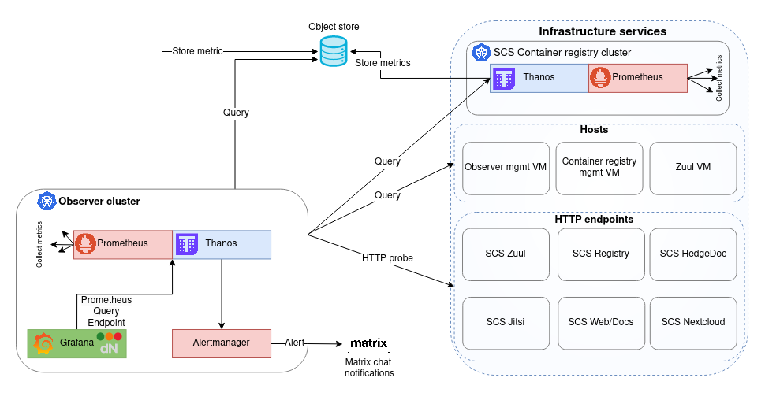

# Overview

This repository aims to build an Observer monitoring solution intended to offer a global **metrics**
view of the CSP infrastructure. It is the platform where CSP infrastructure **metrics**
are fetched, processed, stored, and visualized. Note that this monitoring solution could
be extended, and the other two observability signals (logs and traces) from the CSP
infrastructure could also be processed here.

The Observer monitoring solution is developed on the foundation of the [dNation monitoring solution](https://github.com/dNationCloud/kubernetes-monitoring).
and it is intended to become an **SCS product**.

This repository includes the manifest for the stable deployment of the Observer monitoring solution,
as well as experimental and illustrative examples of how this monitoring solution can be extended and utilized.

The stable version of the Observer monitoring solution empowers its reference SCS installation available
at https://monitoring.scs.community. This deployment covers the monitoring of core SCS infrastructure services,
subsequently referred to as 'Monitoring of infrastructure services'. Refer to the details [here](./scs-deployment.md).
The high-level architecture could be visualized as follows:

Some illustrative and experimental examples of how this monitoring solution can be utilized have been introduced
within the MVP-0 version of this project (refer to the MVP-0 tag, related comments, and docs sections: [kaas](./kaas.md), [iaas](./iaas.md)).
These examples include:
- Monitoring of the KaaS layer
- Monitoring of the IaaS layer

The above experimental components **are not part** of the reference SCS installation available
at https://monitoring.scs.community.
The high-level architecture of these experimental components could be visualized as follows:

