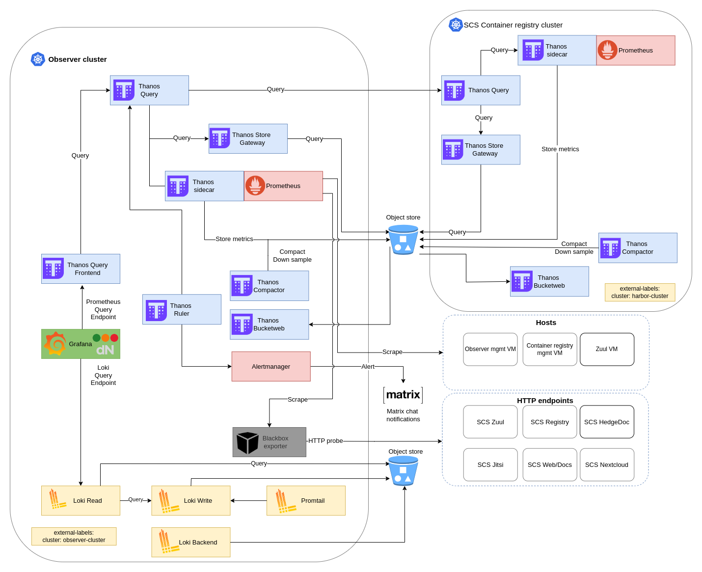

# SCS deployment

The following steps were utilized to deploy the SCS reference installation of the Observer monitoring solution,
which is available at https://monitoring.scs.community.

## Architecture 

Currently, the detailed architecture diagram can be visualized as follows:



## Prerequisites

- Kubernetes cluster
  - We used the R5 version of [SCS KaaS V1](https://github.com/SovereignCloudStack/k8s-cluster-api-provider/), which includes an ingress controller and cert manager
    ```bash
    export KUBECONFIG=/path/to/kubeconfig
    ```
- [kubectl](https://kubernetes.io/docs/reference/kubectl/)
- [helm](https://helm.sh/)

## Install Observer solution

- Apply SCS brand secrets and letsencrypt issuer manifest.
  ```bash
  kubectl apply -f scs/logo.yaml
  kubectl apply -f scs/brand.yaml
  kubectl apply -f scs/issuer.yaml
  ```

- Deploy the Zuul monitoring related Helm chart and all associated manifests according to the instructions provided on [this](./zuul.md) documentation page.

- Deploy the Alertmanager to Matrix chat notifications related manifest according to the instructions provided on [this](./alertmanager.md) documentation page.
 
- Deploy the OAUTH related manifest according to the instructions provided on [this](./oauth.md) documentation page.

- Review the `values-observer-scs.yaml` file and locate all instances of the placeholder text "replace-me".
  These values relate to configuring access to the object store as well as the Grafana admin password.

- Finally, install the monitoring stack using values that incorporate all the configurations mentioned above
```bash
helm repo add dnationcloud https://dnationcloud.github.io/helm-hub/
helm repo update dnationcloud
helm upgrade --install dnation-kubernetes-monitoring-stack dnationcloud/dnation-kubernetes-monitoring-stack -f values-observer-scs.yaml
```
